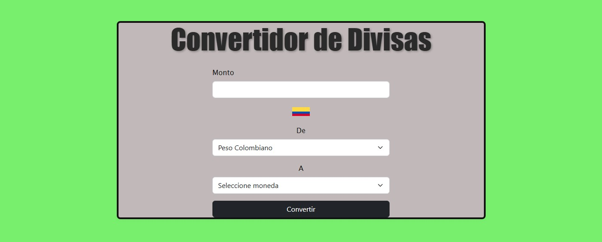
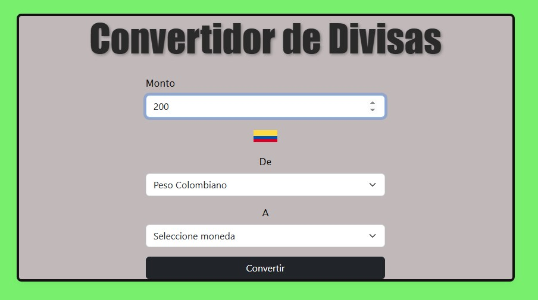
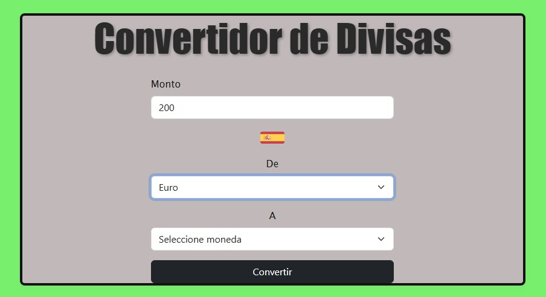
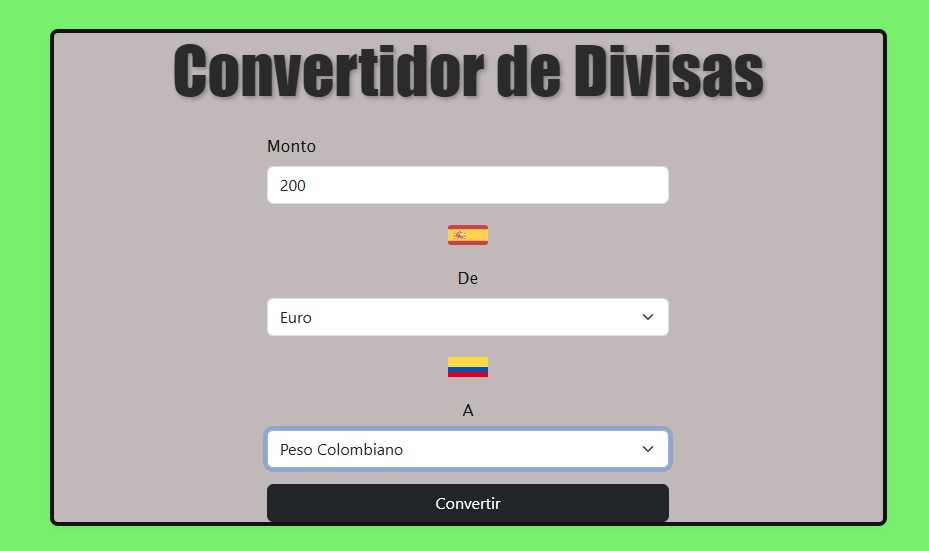
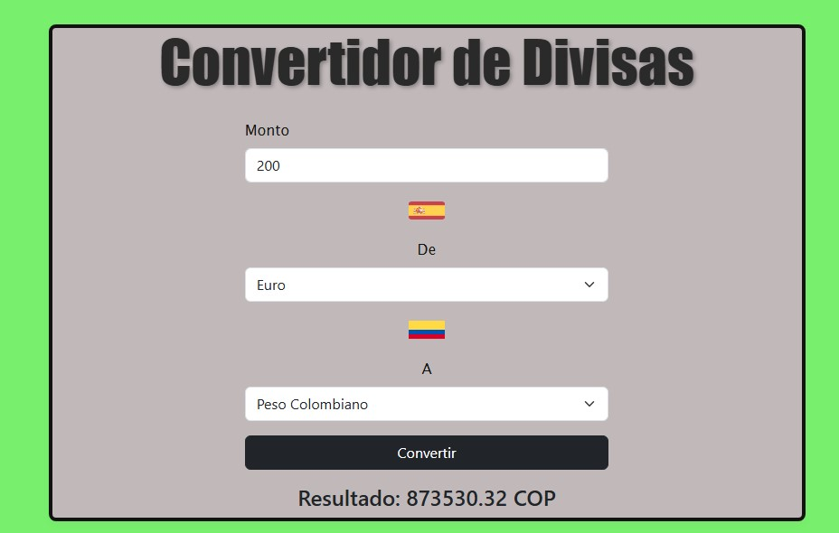

# conversorMonedasReact
Trabajo final Programacion V (CONVERTIDOR DE DIVISAS)

Este proyecto es una aplicación web desarrollada con React que permite convertir valores entre diferentes monedas del mundo en tiempo real. Utiliza una API externa para obtener tasas de cambio actualizadas y muestra las banderas correspondientes a cada divisa seleccionada.

Descripción General del Proyecto:

El Convertidor de Divisas permite al usuario:

-- Elegir una moneda base.
-- Seleccionar la moneda destino.
-- Ingresar la cantidad a convertir.
-- Ver el resultado inmediatamente utilizando datos reales obtenidos desde una API.
-- Visualizar la bandera asociada a cada moneda seleccionada.

El proyecto implementa:

-- React + Hooks (useState)
-- Bootstrap para estilos
-- Fetch API para consumir datos externos
-- Manejo de errores y estados de carga
-- Archivos de banderas dentro de /public/flags/

API Utilizada (ExchangeRate-API)

Nombre: ExchangeRate API (Versión 6)

Enlace: https://www.exchangerate-api.com/

Endpoint utilizado:

https://v6.exchangerate-api.com/v6/TU_API_KEY/latest/{CURRENCY}

Se usa para obtener las tasas de cambio actualizadas basadas en la moneda seleccionada.

Instrucciones de Instalación y Ejecución

1. Clonar el repositorio

git clone https://github.com/mfhenao/conversorMonedasReact.git

Luego entra a la carpeta del proyecto:

cd conversorMonedasReact

2. Instalar dependencias

Debes tener Node.js instalado.

Ejecuta:

npm install

3. Crear el archivo de las banderas

en el archivo debe existir esta carpeta con las imagnes de las banderas:

public/
 └── flags/
       USD.png
       EUR.png
       CHF.png
       ...

Todas las imágenes deben tener el mismo nombre que la propiedad flag del array currencies.

4. Configurar API Key

En tu componente (CambioDivisa.jsx) debes reemplazar

const API_KEY = 'TU_API_KEY_AQUI';

Por tu propia API Key obtenida desde ExchangeRate-API.

5. Ejecutar la aplicación
npm start

El proyecto abrirá automáticamente en:

http://localhost:3000/

PROCESO DE CONVERSION!!!!

Interfaz de la Api

Paso 1:

Paso 2:

Paso 3: 

Paso 4:

